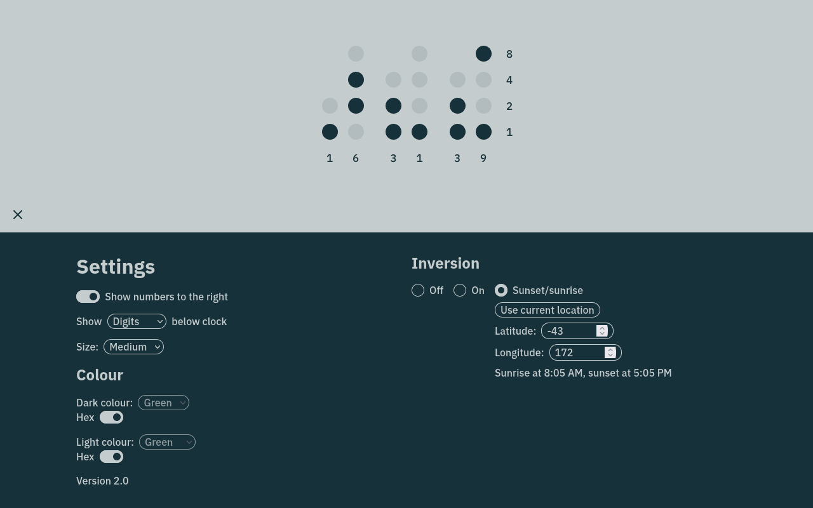

<p align="center">
  
</p>
<h1 align="center">Binary tab</h1>

A simple and configurable full-screen binary clock. Available on a new tab page near you!



This is a Svelte rewrite of the jQuery-based original. Svelte seemed like a good choice for its simple store utilities and small compiled output.

Features:

- **Cross-platform**: Capable of running as a Firefox new tab page extension, Chrome new tab page extension or standalone web app. The mode of operation is detected automatically.
- **Validated config**: Config schema is defined using Zod. Only valid schemas will be committed to storage.
- **Config migrations**: A config schema change is as simple as defining a new schema and a migration from the previous version. Any outdated schemas present in a user's storage will be upgraded on launch.

## Install dependencies

```shell
npm install
```

## Develop it

```shell
npm run dev
```

## Unit test

```shell
npm run test
```

## Build and serve

```shell
npm run build
npm run preview
```
